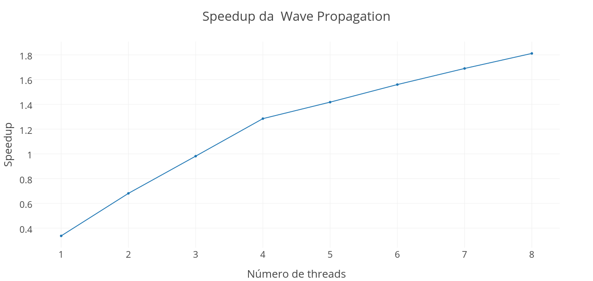

% Computação de Alto Desempenho - Trabalho Prático 2
% Alunos: Bernardo Amorim & Marcos Seefelder; Professor: José Camata; Engenharia de Computação e Informação - UFRJ
% 11/07/2016

## Ambiente computacional:

Processador: Intel® Core™ i7-3610QM CPU @ 2.30GHz × 8 

Memória: 7,7 GiB

# Exercício 1

## Configuração:

O código foi compilado com `tau_cc.sh openmp -O -DSTREAM_ARRAY_SIZE=2988441 stream.c -o stream`.

## Gráficos e análise:

Os gráficos a seguir foram gerados utilizando a aplicação *paraprof*:

\

*Gráfico de barras do tempo consumido por linha de código para cada thread.*

\

*Gráfico de barras do tempo consumido por linha de código para cada thread.*

Pode-se perceber que a carga é balanceada, pois os tempos consumidos por instrução em cada *thread* são próximos para a maioria das instruções. Algumas pequenas excessões podem ser percebidas, as quais são compensadas com tempo de espera nas barreiras de sincronização.


# Exercício 2

## Modificações no código:

No final da rotina `Deallocate3DMatrix` faltava um `free(array)`, o qual adicionamos. Além disso, fizemos algumas alterações na rotina `iso_3dfd_it`, resultando no seguinte código (apenas o código interno está exposto):

```cpp
{
	//declaramos value aqui fora mas zero a cada loop lá dentro
	float value = 0.0;
	//variável auxiliar para utilizar no loop mais interno
	float internalvalue = 0.0;
	//Para não ter que ficar acessando coeff
	const float zerocoeff = coeff[0];

	//coloquei as restrições do if nos loops
	//Inverti a ordem para aproveitar a ordem de indexação do C++
	for (int i = HALF_LENGTH; i<(n1 - HALF_LENGTH); i++)
	   for (int j = HALF_LENGTH; j<(n2 - HALF_LENGTH); j++) {
			for (int k = HALF_LENGTH;k<(n3 - HALF_LENGTH); k++) {
			{
				//continuo zerando o value a cada loop
				value = 0.0;

				//Parte dessa linha ficava após o loop que vem a seguir. 
				//Quebrei ela e faço essa parte logo.
				ptr_next[i][j][k] = ptr_prev[i][j][k]+ptr_prev[i][j][k] - ptr_next[i][j][k];
				value += ptr_prev[i][j][k] * zerocoeff;
				
				for (int ir = 1; ir <= HALF_LENGTH; ir++) {
					internalvalue = 0.0;
					//Faço todas as somas e depois multiplico
					internalvalue += ptr_prev[i+ir][j][k] + ptr_prev[i-ir][j][k]
						+ ptr_prev[i][j+ir][k] + ptr_prev[i][j-ir][k]
						+ ptr_prev[i][j][k+ir] + ptr_prev[i][j][k-ir];
					internalvalue *= coeff[ir];
					value += internalvalue;
				}

				ptr_next[i][j][k] += value*ptr_vel[i][j][k];

			}
		}
	}
}

```

Posteriormente, foram adicionados `#pragma`s do OpenMP, para paralelização dos loops de for presentes nas rotinas `initialize` e `iso_3dfd_it`. O código segue em anexo, em *ex2/wave/*.

## Compilação e problemas:

Vale ressaltar que enfrentamos diversos problemas na hora de compilar o código e em seguida apresentamos como resolvemos os dois principais problemas:

* Primeiramente, os `#pragma`s do OpenMP precisaram ser indentados no início das linhas, caso contrário os parsers no processo de compilação do tau apresentavam erros;

* Além disso, a linha `fprintf(fout, "splot \'%s_%03d.dat\' u 1:2:3 t\"\"\n", rootname, t_step);` na função `write_plane_XY` fazia com que o Opari Parser lançasse uma **falha de segmentação**. Nossa solução foi comentar a parte do código que escreve os arquivos de extensão `.plot` e criá-los em uma aplicação separada, o que não atrapalha o funcionamento e permite conferir se os resultados obtidos são corretos.

No fim, a compilação, usando `Makefile.tau-papi-pdt-openmp-opari`, foi feita com o comando `tau_cc.sh -openmp main.cc -o wave`.


## Resultados:

Para a execução e posterior análise, utilizamos o comando `export TAU_METRICS=GET_TIME_OF_DAY\:PAPI_FP_INS` para definir os eventos capturados. Capturamos *PAPI_FP_INS* no caso de querermos analisar a medida de *flops* nas *threads*, mas acabamos não utilizando os valores obtdos. 

A seguir, apresentamos os resultados para o código em diferentes tipos de configuração.

Testamos com e sem `collapse()` no conjunto de *loops* que representava o maior tempo de processamento, na função `iso_3dfd_it`. Não fizemos uma versão com sincronização explícita, pois utilizamos apenas o `#pragma omp parallel for` e não consideramos que fosse aplicável no caso.

### Sem `collapse()`:

**Tempo de execução**: 5m6.643s

### Com `collapse()` e `schedule(static)`:

**Tempo de execução**: 5m15.586s

### Com `collapse()` e `schedule(dynamic)`:

**Tempo de execução**: 6m5.894s

### Com `collapse()` e `schedule(guided)`:

**Tempo de execução**: 4m35.420s

## Análise e escalabilidade:

O melhor tempo de execução foi obtido **colapsando os 3 *loops* em 1** e utilizando **escalonamento guiado**.

\

*Distribuição de carga com `collapse()` e `schedule(guided)`, gráfico do tempo de execução para as instruções*

Pode-se perceber que a carga está muito balanceada entre as *threads*, sendo as duas únicas rotinas que aparecem destacadas no gráfico o *loop* colapsado na função `iso_3dfd_it` (em vermelho) e a barreira implícita do loop (em azul).

Executamos esse melhor caso com 1,2,3,..,8 *threads* (limite de *cores* do ambiente comptacional), medimos o tempo com a rotina *time* do *Linux* e apresentamos a seguir o gráfico de *speedup* em realção ao tempo de execução sequencial que foi de *8 minutos 4 segundos e 60 milésimos de segundo*:

\

*Gráfico: Tempos da wave propagation*

Podemos então verificar que a partir de 4 *threads* a solução paralela supera a sequencial.

\

*Gráfico: Speedup da wave propagation*

Podemos verificar que há um ganho de velocidade com o aumento do número de *threads*, comprovando o *escalonamento forte*

# Exercício 3

## Código:

Implementamos o cálculo de pi com a linguagem de programação C++ no padrão C++11. A seguir apresentamos o código principal no cálculo de pi:

```cpp
double calculatePI () {
	double M, N;
	#pragma omp parallel reduction(+:M,N)
	{
		double x, y, length;
		int tn = omp_get_thread_num();
		M = 0.0; N = 0.0;
		std::random_device rd;
	    std::mt19937 gen(rd());
	    std::uniform_real_distribution<> dis(-0.5, 0.5);

	    for (int i = 0; i < SIZE; ++i)
	    {
	    	x = dis(gen);
	    	y = dis(gen);

	    	length = x*x + y*y;
	    	N++;
	    	M = (length <= 0.25) ? M+1.0 : M;
	    }

	}
	#pragma omp barrier

	double pi = 4.0*M/N;
	return pi;
}
``` 

O código pode ser lido na íntegra em anexo, no diretório *ex3/*.

## Testes:

Testamos para `#define SIZE 500`, ou seja, **500 amostras por *thread*** para **1 a 10 *threads***. Para cada um dos valores de número de *threads*, executamos a função `calculatePI()` **$10^4$ vezes**, armazenando a média da diferença do valor obtido para pi e a variância dessa diferença.

## Resultados e análise:

\

*Gráfico: Diferença em relação a pi x número de threads, desvio padrão apresentado como erro*

\

*Balanceamento de carga para 8 threads e $10^6$ amostras por thread e apenas uma chamada de `calculatePI()`*

Podemos observar no gráfico que relaciona a diferença do resultado obtido em relação a pi e o número de *threads* que o aumento do número de *threads* diminui a diferença e o desvio padrão, comprovando o *escalonamento fraco* da solução.

Cabe ressaltar que a aplicação apresenta-se consideravelmente balanceada, como pode ser vista no gráfico 3D exposto acima. As barras mais altas são relativas ao for na região paralela do `calculatePI()` e as barras mais baixas são a espera no `#pragma omp barrier`.

# Exercício 4

